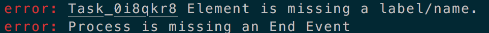

# bpmnlint
Linter for BPMN diagrams.

## Installing

```sh
npm install -s bpmnlint
```

Or:

```sh
yarn add bpmnlint
```

## Usage

### As a command line tool
- Make sure to have a **.bpmnlintrc** configuration file in the directory where you are running the tool:

```json
// .bpmnlintrc  file

{
  "label-required": 1,
  "start-event-required": 2,
  "end-event-required": 2
}
```

- Run the following command:
```sh
bpmnlint ./sample.bpmn
```

- Output:


### Configuration
The configuration file is a JSON object where the keys represent the rule names and their values provide information about these rules.

These values can be specified in an implicit or explicit way.

> **Note:** bpmnlint comes with a list of built-in rules: label-required, start-event-required, and end-event-required.

### Implicit Configuration
If the specified value for a rule is a number, it will hold the rule status flag: 
- 0: the rule is off
- 1: problems reported by the rule are considered as warnings
- 2: problems reported by the rule are considerd as errors

```json
{
  "label-required": 1
}
```

bpmnlint will then look for the rule first in the built-in rules. 
If not found, bpmnlint will look for the rule in the npm packages installed as **bpmn-**rule-name (e.g. bpmn-no-implicit-parallel-gateway).

> **Important: ** if you're referring to a non built-in rule, make sure to have it installed as an npm dependency.

### Explicit Configuration
If the specified value for a rule is an object, it will hold the following information: 
- path to the the rule.
- flag: rule status flag

```json
{
  "bpmnlint-some-custom-rule": { 
    "path": "some/local/path/bpmnlint-some-custom-rule", 
    "flag": 2
  }
}
```

### Adding Custom Rules 
> **Important:** The rule needs to have a suffix of 'bpmnlint-'.

Custom rules can be added in two ways:

#### As an NPM Module
Please check out the example of [no-implicit-parallel-gateway](https://github.com/siffogh/bpmnlint-no-implicit-parallel-gateway)

#### As a Local Module
```json
{
  "bpmnlint-some-custom-rule": { 
    "path": "some/local/path/bpmnlint-some-custom-rule", 
    "flag": 2
  }
}
```