# Rules

## Conditional Flows

A rule that checks that sequence flows outgoing from a conditional forking gateway or activity are either default flows _or_ have a condition attached.

> Message: ❌ Sequence flow is missing condition

### Wrong ❌

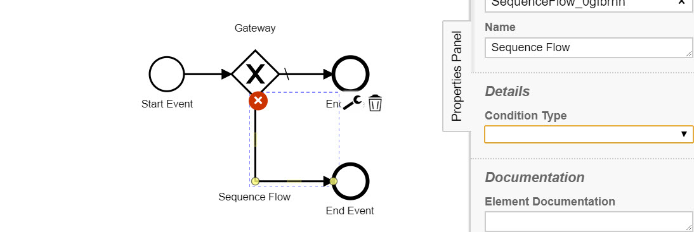

### Right ✔️

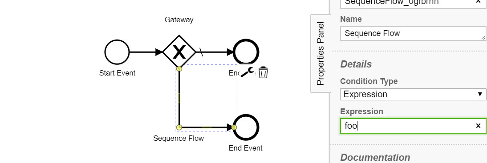

## End Event Required

A rule that checks the presence of an end event per scope.

> Message: ❌ Process is missing end event

### Wrong ❌

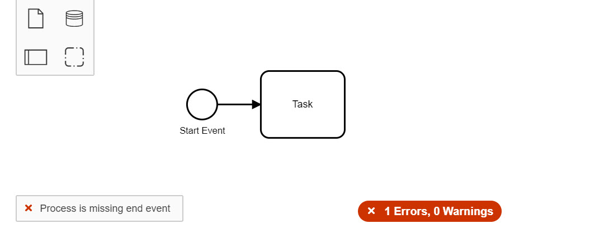

### Right ✔️

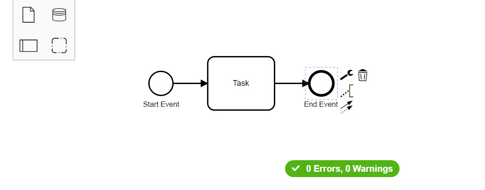

## Event Sub Process Typed Start Event

A rule that checks that start events inside an event sub-process are typed.

> Message: ❌ Start event is missing event definition

### Wrong ❌

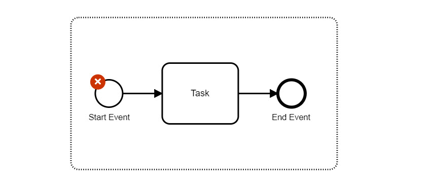

### Right ✔️

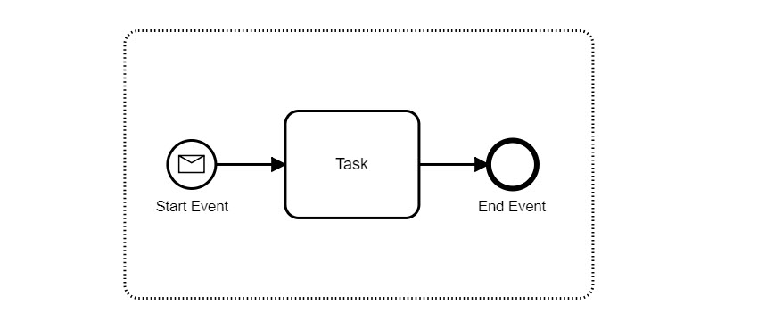

## Fake Join

 A rule that checks that no fake join is modeled by attempting to give a task or event join semantics. Users should model a parallel joining gateway to achieve the desired behavior.

 > Message: ⚠️ Incoming flows do not join

### Wrong ⚠️

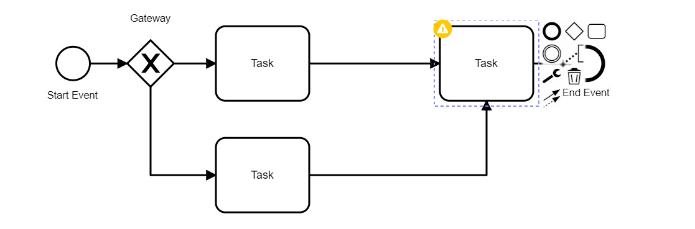

### Right ✔️

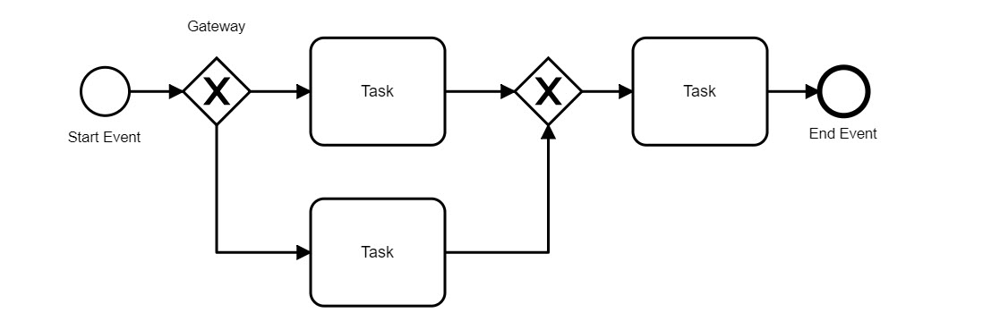

## Label Required

A rule that checks the presence of a label.

> Message: ❌ Element is missing label/name

### Wrong ❌

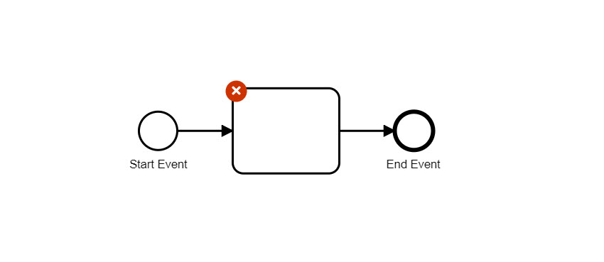

### Right ✔️

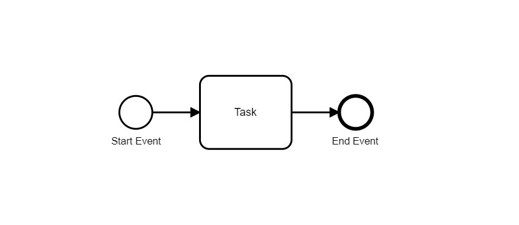

## No Complex Gateway

A rule that disallows complex gateways.

> Message: ❌ Element has disallowed type.

### Wrong ❌

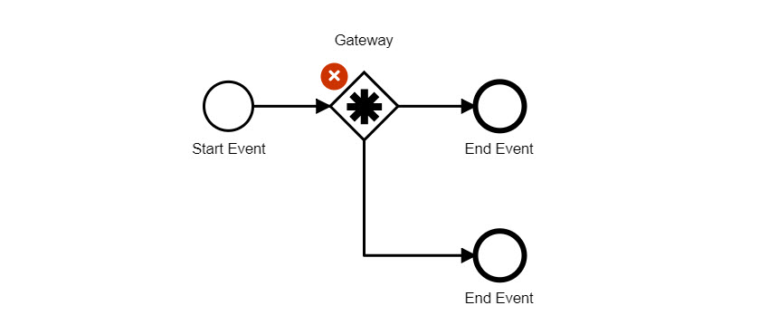

### Right ✔️

## No Disconnected

A rule that verifies that there exists no disconnected flow elements, i.e. elements without incoming _or_ outgoing sequence flows.

> Message: ❌ Element is not connected

### Wrong ❌

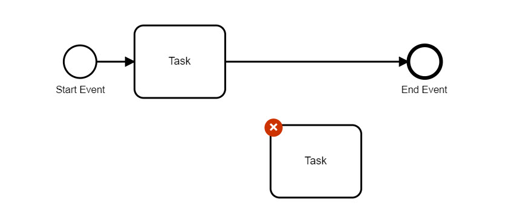

### Right ✔️

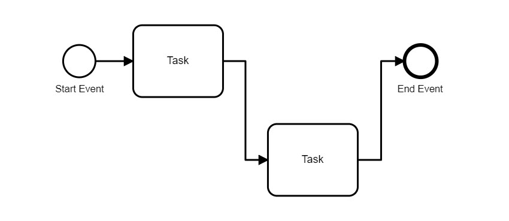

## No Duplicate Sequence Flows

A rule that verifies that there are no disconnected flow elements, i.e. elements without incoming _or_ outgoing sequence flows.

> Message: ❌ SequenceFlow is a duplicate

### Wrong ❌

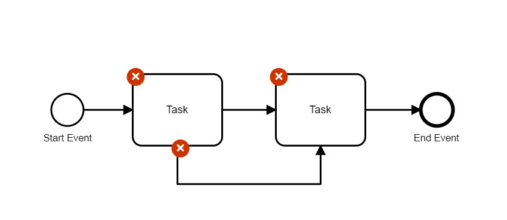

### Right ✔️

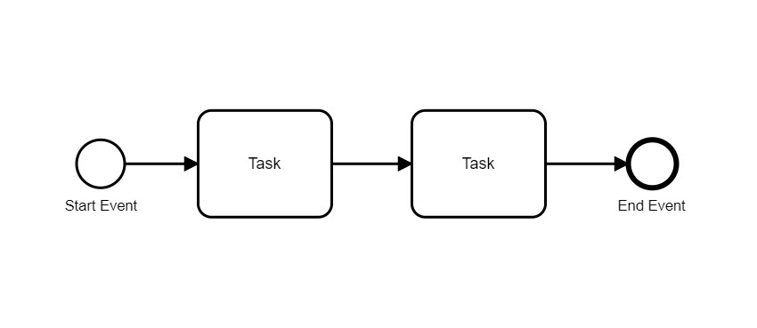

## No Gateway Join Fork

A rule that checks, whether a gateway forks and joins at the same time.

> Message: ❌ Gateway joins and forks

### Wrong ❌

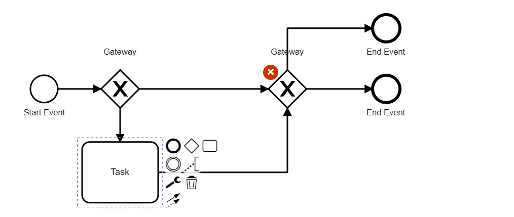

### Right ✔️

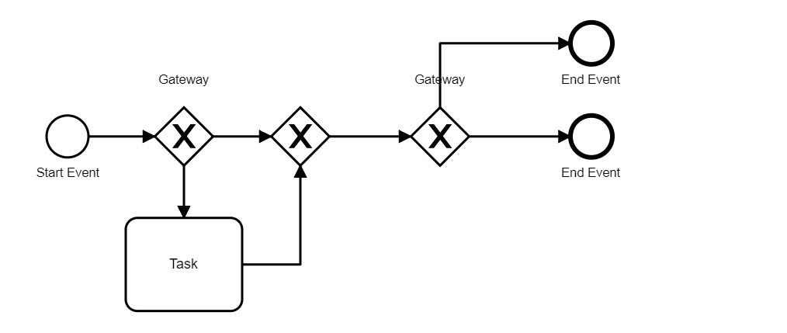

## No Implicit Split

 A rule that checks that no implicit split is modeled starting from a task. Users should model the parallel splitting gateway explicitly instead.

> Message: ❌ Flow splits implicitly

### Wrong ❌

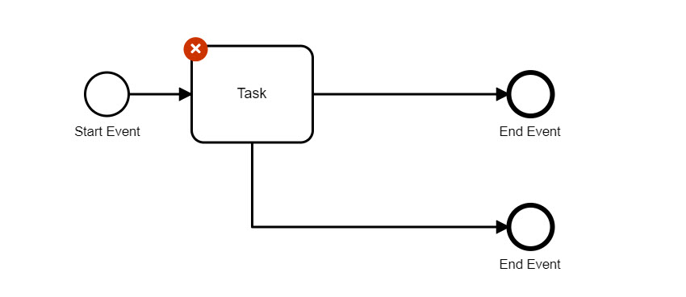

### Right ✔️

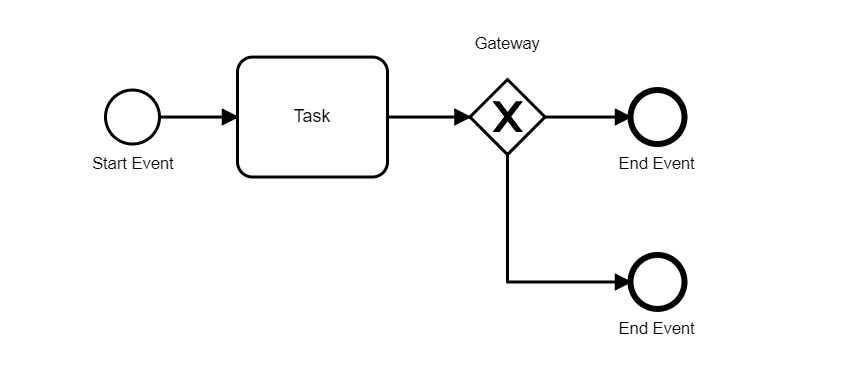

## No Inclusive Gateway

A rule that disallows inclusive gateways.

> Message: ❌ Element has disallowed type.

### Wrong ❌

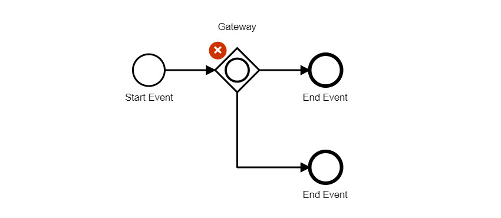

### Right ✔️

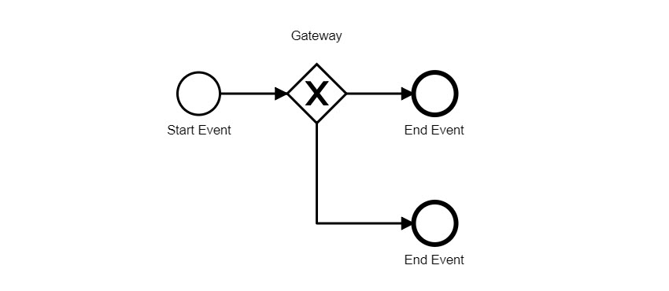

## Single Blank Start Event

A rule that checks whether not more than one blank start event exists per scope.

> Message: ❌ Process has multiple blank start events.

### Wrong ❌

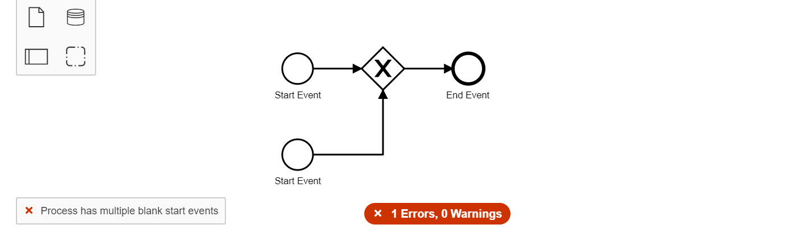

### Right ✔️

## Single Event Definition

A rule that verifies that an event contains maximum one event definition.

> Message: ❌ Event has multiple event definitions

### Wrong ❌

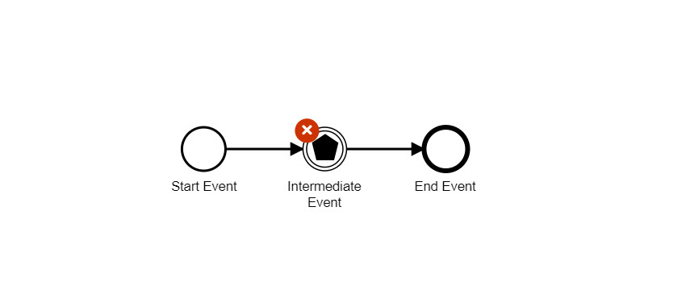

### Right ✔️

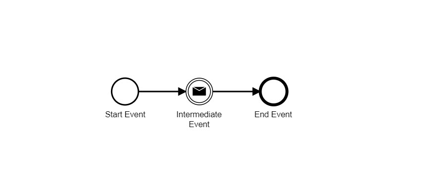

## Start Event Required

A rule that checks for the presence of a start event per scope.

> Message: ❌ Sub process is missing start event

### Wrong ❌

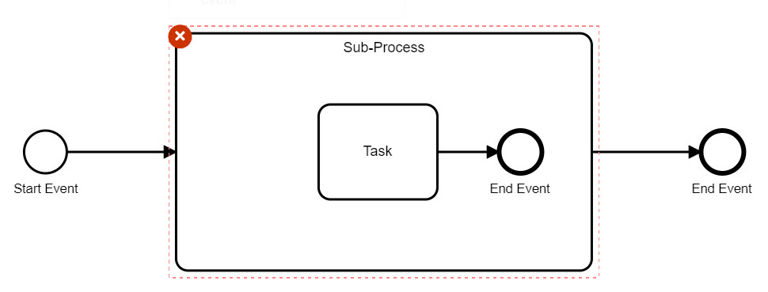

### Right ✔️

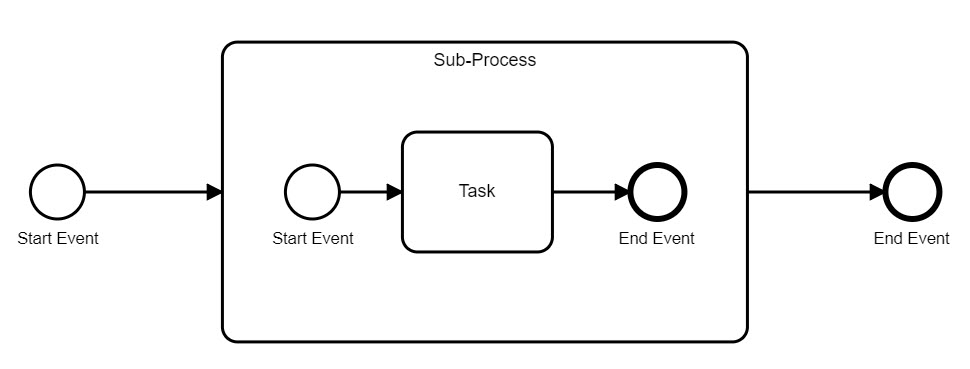

## Sub Process Blank Start Event

A rule that checks that start events inside a normal sub-processes are blank (do not have an event definition).

> Message: ❌ Start event must be blank

### Wrong ❌

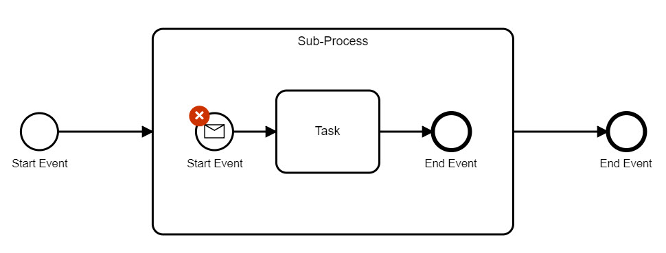

### Right ✔️

