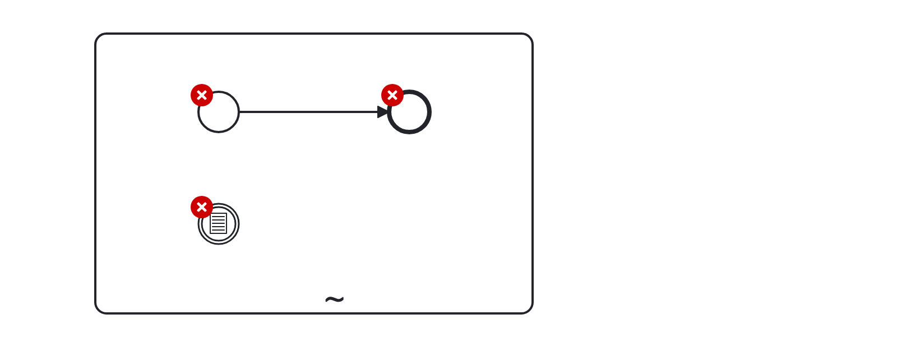
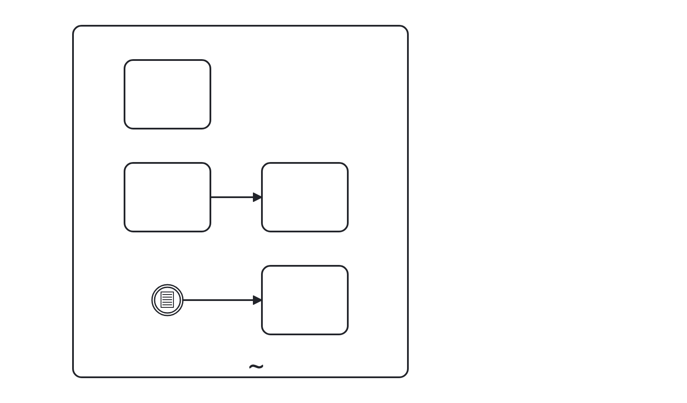

# Ad-hoc Sub-Process (ad-hoc-sub-process)

Ensure that an Ad-Hoc Sub-Process is valid according to the BPMN specification:

- Must not contain start or end events.
- Every intermediate catch event must have an outgoing sequence flow.

Example of __incorrect__ usage for this rule:

Cf. [`ad-hoc-sub-process-incorrect.bpmn`](./examples/no-complex-gateway-incorrect.bpmn).

Example of __correct__ usage for this rule:

Cf. [`ad-hoc-sub-process-correct.bpmn`](./examples/no-complex-gateway-correct.bpmn).
