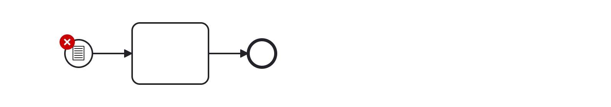

# Conditional Event (conditional-event)

Ensures that a conditional event has a condition specified.


Example of __incorrect__ usage for this rule:



```xml
<bpmn:startEvent id="Event_0dydcz1">
  <bpmn:conditionalEventDefinition id="ConditionalEventDefinition_0vbza3y">
    <bpmn:condition xsi:type="bpmn:tFormalExpression"/>
  </bpmn:conditionalEventDefinition>
</bpmn:startEvent>
```

Cf. [`conditional-event-incorrect.bpmn`](./examples/conditional-event-incorrect.bpmn).


Example of __correct__ usage for this rule:


```xml
<bpmn:startEvent id="Event_0dydcz1">
  <bpmn:conditionalEventDefinition id="ConditionalEventDefinition_0vbza3y">
    <bpmn:condition xsi:type="bpmn:tFormalExpression">=someCondition</bpmn:condition>
  </bpmn:conditionalEventDefinition>
</bpmn:startEvent>
```

Cf. [`conditional-event-correct.bpmn`](./examples/conditional-event-correct.bpmn).