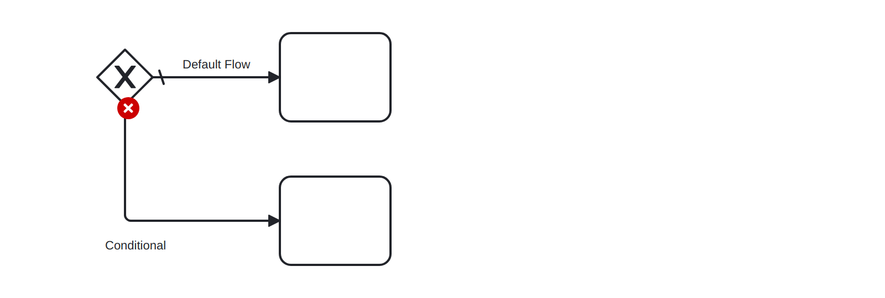
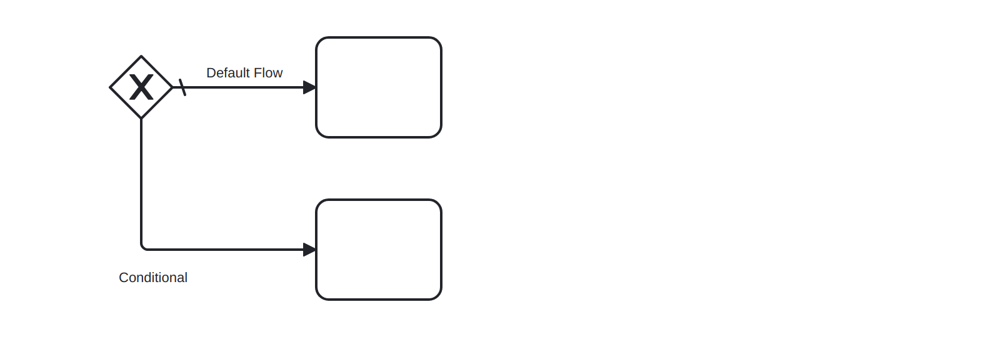

# Conditional Flows (conditional-flows)

Ensures that conditions on sequence flows are consistently set. If a sequence flow outgoing from a conditional forking gateway or activity is default _or_ any sequence flow has a condition attached, all others have to have to have respective condition meta-data attached, too.


Example of __incorrect__ usage for this rule:



```xml
    ...
    <bpmn:sequenceFlow name="Conditional" />
    ...
```

Cf. [`conditional-flows-incorrect.bpmn`](./examples/conditional-flows-incorrect.bpmn).


Example of __correct__ usage for this rule:



```xml
    ...
    <bpmn:sequenceFlow name="Conditional">
      <bpmn:conditionExpression>foo</bpmn:conditionExpression>
    </bpmn:sequenceFlow>
    ...
```

Cf. [`conditional-flows-correct.bpmn`](./examples/conditional-flows-correct.bpmn).