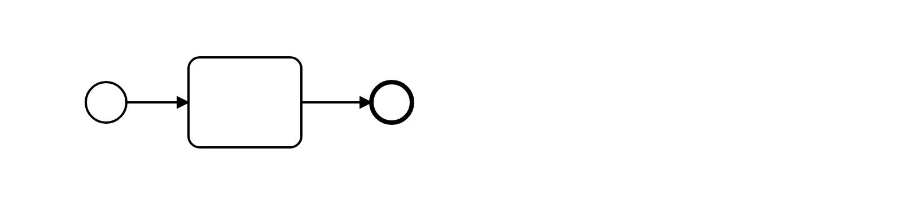

# End Event Required (end-event-required)

Ensures that every process and sub-process has an end event. Explicitly modeling it improves the understandability of drawn process diagrams.

Example of __incorrect__ usage for this rule:

Cf. [`end-event-required-incorrect.bpmn`](./examples/end-event-required-incorrect.bpmn).

Example of __correct__ usage for this rule:

Cf. [`end-event-required-correct.bpmn`](./examples/end-event-required-correct.bpmn).