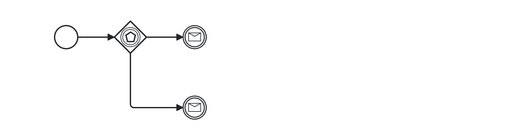

# Event-based Gateway (event-based-gateway)

Ensures that an event-based gateway is valid according to the BPMN specification:

- Has at least 2 outgoing sequence flows.
- The outgoing sequence flows are not conditional.

Example of __incorrect__ usage for this rule:

Cf. [`event-based-gateway-incorrect.bpmn`](./examples/event-based-gateway-incorrect.bpmn).

Example of __correct__ usage for this rule:

Cf. [`event-based-gateway-correct.bpmn`](./examples/event-based-gateway-correct.bpmn).