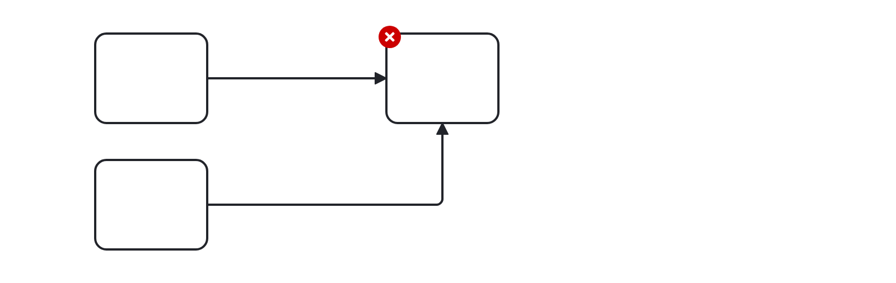
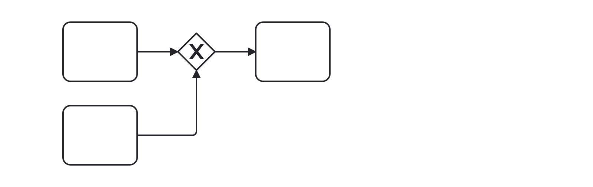

# Fake Join (fake-join)

Checks that no fake join is modeled by attempting to give a task or event join semantics. Users should model a parallel joining gateway to achieve the desired behavior.


Example of __incorrect__ usage for this rule:



```xml
    ...
    <bpmn:task id="Task_2">
      <bpmn:incoming>SequenceFlow_1</bpmn:incoming>
      <bpmn:incoming>SequenceFlow_2</bpmn:incoming>
    </bpmn:task>
    ...
```

Cf. [`fake-join-incorrect.bpmn`](./examples/fake-join-incorrect.bpmn).


Example of __correct__ usage for this rule:



```xml
    ...
    <bpmn:task id="Task_2">
      <bpmn:incoming>SequenceFlow_1</bpmn:incoming>
    </bpmn:task>
    ...
```

Cf. [`fake-join-correct.bpmn`](./examples/fake-join-correct.bpmn).
