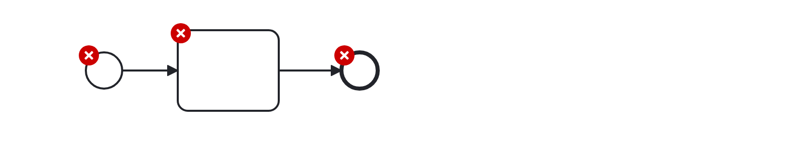

# Label Required (label-required)

Checks the presence of a label.


Example of __incorrect__ usage for this rule:



```xml
    ...
    <bpmn:task id="Task_1">
      <bpmn:incoming>SequenceFlow_1</bpmn:incoming>
      <bpmn:outgoing>SequenceFlow_2</bpmn:outgoing>
    </bpmn:task>
    ...
```

Cf. [`label-required-incorrect.bpmn`](./examples/label-required-incorrect.bpmn).


Example of __correct__ usage for this rule:


```xml
    ...
    <bpmn:task id="Task_1" name="Eat">
      <bpmn:incoming>SequenceFlow_1</bpmn:incoming>
      <bpmn:outgoing>SequenceFlow_2</bpmn:outgoing>
    </bpmn:task>
    ...
```

Cf. [`label-required-correct.bpmn`](./examples/label-required-correct.bpmn).