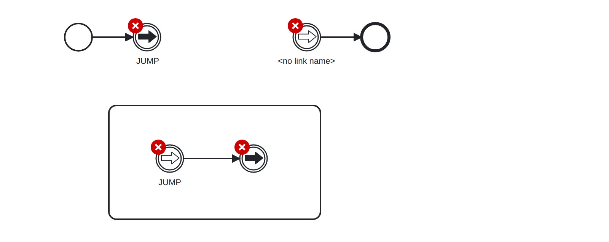
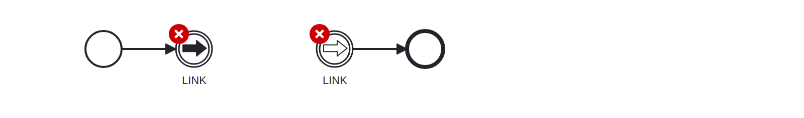

# Link Event (link-event)

A rule that checks that link events are used in accordance with the BPMN specification:

* A link event must be named
* For every link throw event there exists a matching catch event in the same scope

Example of __incorrect__ usage for this rule:

Cf. [`link-event-incorrect.bpmn`](./examples/link-event-incorrect.bpmn).

Example of __correct__ usage for this rule:

Cf. [`link-event-correct.bpmn`](./examples/link-event-correct.bpmn).
