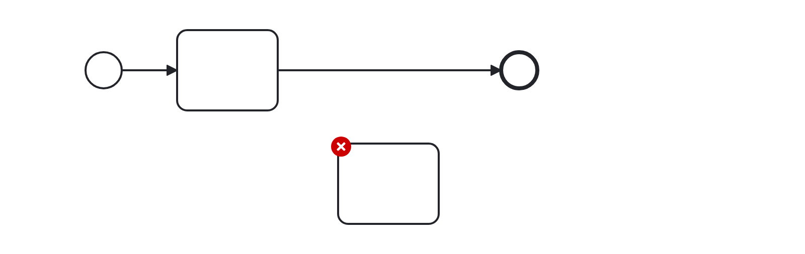

# No Disconnected (no-disconnected)

Checks that a flow element is connected with other flow elements, either via  incoming _or_ outgoing sequence flows.

Example of __incorrect__ usage for this rule:

Cf. [`no-disconnected-incorrect.bpmn`](./examples/no-disconnected-incorrect.bpmn).

Example of __correct__ usage for this rule:

Cf. [`no-disconnected-correct.bpmn`](./examples/no-disconnected-correct.bpmn).