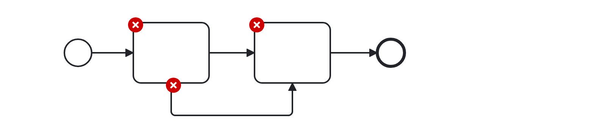

# No Duplicate Sequence Flows (no-duplicate-sequence-flows)

Checks that sequence flows do not duplicate, leading to an unintentional fork.

Example of __incorrect__ usage for this rule:

Cf. [`no-duplicate-sequence-flows-incorrect.bpmn`](./examples/no-duplicate-sequence-flows-incorrect.bpmn).

Example of __correct__ usage for this rule:

Cf. [`no-duplicate-sequence-flows-correct.bpmn`](./examples/no-duplicate-sequence-flows-correct.bpmn).