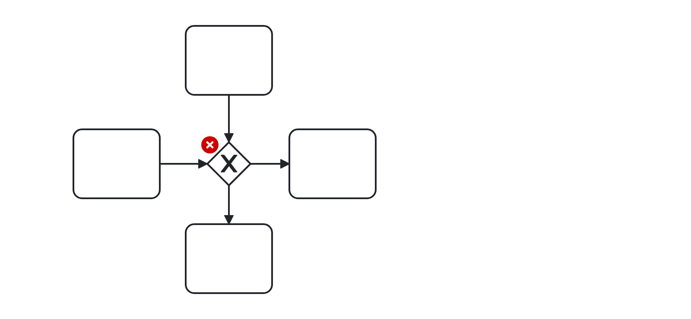
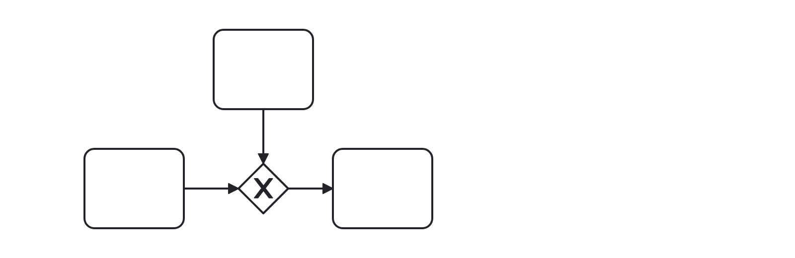

# No Gateway Join Fork (no-gateway-join-fork)

A rule that checks, whether a gateway forks and joins at the same time.


Example of __incorrect__ usage for this rule:



```xml
    ...
    <bpmn:exclusiveGateway id="ExclusiveGateway_1">
      <bpmn:incoming>SequenceFlow_1</bpmn:incoming>
      <bpmn:incoming>SequenceFlow_2</bpmn:incoming>
      <bpmn:outgoing>SequenceFlow_3</bpmn:outgoing>
      <bpmn:outgoing>SequenceFlow_4</bpmn:outgoing>
    </bpmn:exclusiveGateway>
    ...
```

Cf. [`no-gateway-join-fork-incorrect.bpmn`](./examples/no-gateway-join-fork-incorrect.bpmn).


Example of __correct__ usage for this rule:



```xml
    ...
    <bpmn:exclusiveGateway id="ExclusiveGateway_1">
      <bpmn:incoming>SequenceFlow_1</bpmn:incoming>
      <bpmn:incoming>SequenceFlow_2</bpmn:incoming>
      <bpmn:outgoing>SequenceFlow_3</bpmn:outgoing>
    </bpmn:exclusiveGateway>
    ...
```

Cf. [`no-gateway-join-fork-correct.bpmn`](./examples/no-gateway-join-fork-correct.bpmn).