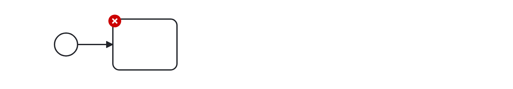
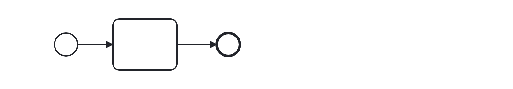

# No Implicit End (no-implicit-end)

Checks that no implicit ends are modeled starting on a diagram. Users should model ends (token sinks) explicitly using end events to promote readability of a diagram.

Example of __incorrect__ usage for this rule:

Cf. [`no-implicit-end-incorrect.bpmn`](./examples/no-implicit-end-incorrect.bpmn).

Example of __correct__ usage for this rule:

Cf. [`no-implicit-end-correct.bpmn`](./examples/no-implicit-end-correct.bpmn).