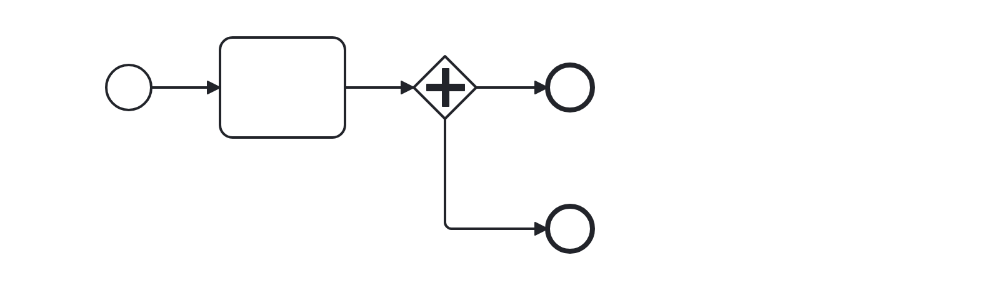

# No Implicit Split (no-implicit-split)

Checks that no implicit split is modeled starting from a task. Users should model the parallel splitting gateway explicitly instead.

Example of __incorrect__ usage for this rule:

Cf. [`no-implicit-split-incorrect.bpmn`](./examples/no-implicit-split-incorrect.bpmn).

Example of __correct__ usage for this rule:

Cf. [`no-implicit-split-correct.bpmn`](./examples/no-implicit-split-correct.bpmn).