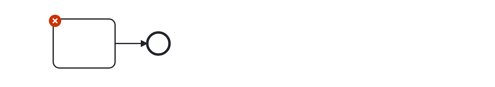
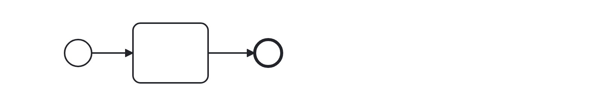

# No Implicit Start (no-implicit-start)

Checks that no implicit starts are modeled starting on a diagram. Users should model starts (token spawns) explicitly using start events to promote readability of a diagram.

Example of __incorrect__ usage for this rule:

Cf. [`no-implicit-start-incorrect.bpmn`](./examples/no-implicit-start-incorrect.bpmn).

Example of __correct__ usage for this rule:

Cf. [`no-implicit-start-correct.bpmn`](./examples/no-implicit-start-correct.bpmn).