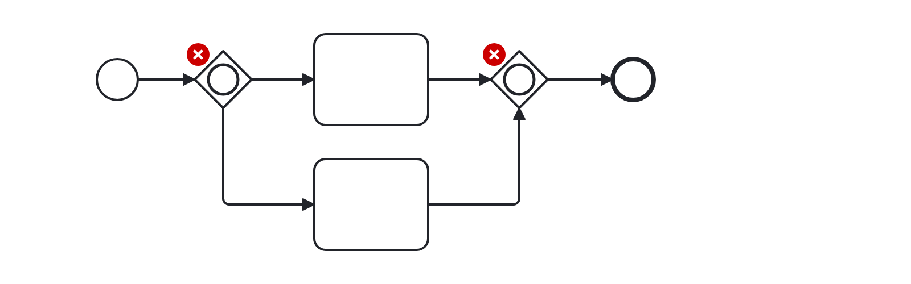
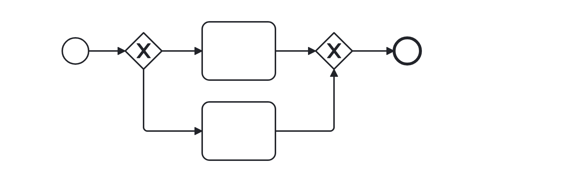

# No Inclusive Gateway (no-inclusive-gateway)

Checks for the presence of inclusive gateways.

Example of __incorrect__ usage for this rule:

Cf. [`no-inclusive-gateway-incorrect.bpmn`](./examples/no-inclusive-gateway-incorrect.bpmn).

Example of __correct__ usage for this rule:

Cf. [`no-inclusive-gateway-correct.bpmn`](./examples/no-inclusive-gateway-correct.bpmn).