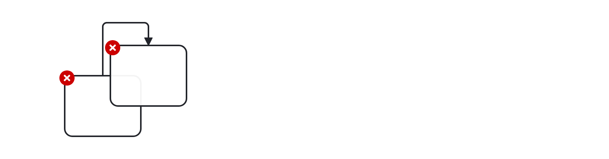

# No Overlapping Elements (no-overlapping-elements)

Checks that elements are not overlapping with each other unintentionally.
To prevent misinterpretation ensure that a diagram is clearly layouted with sufficient space between flow elements.

Example of __incorrect__ usage for this rule:

Cf. [`no-overlapping-elements-incorrect.bpmn`](./examples/no-overlapping-elements-incorrect.bpmn).

Example of __correct__ usage for this rule:

Cf. [`no-overlapping-elements-correct.bpmn`](./examples/no-overlapping-elements-correct.bpmn).