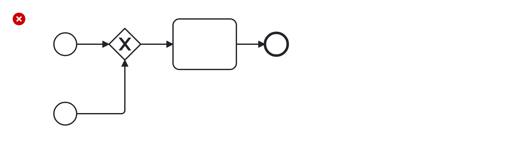

# Single Blank Start Event (single-blank-start-event)

Checks that there is only a single blank start event per process (or sub-process).

Example of __incorrect__ usage for this rule:

Cf. [`single-blank-start-event-incorrect.bpmn`](./examples/single-blank-start-event-incorrect.bpmn).

Example of __correct__ usage for this rule:

Cf. [`single-blank-start-event-correct.bpmn`](./examples/single-blank-start-event-correct.bpmn).