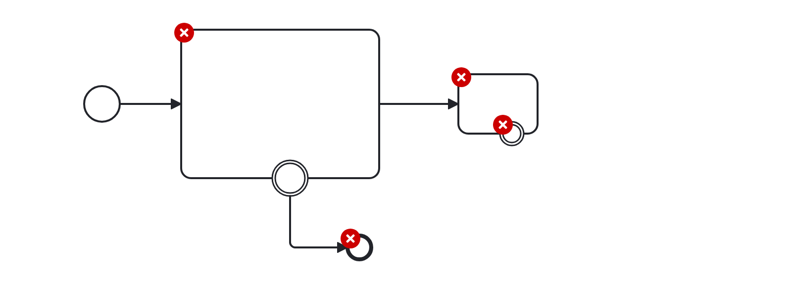
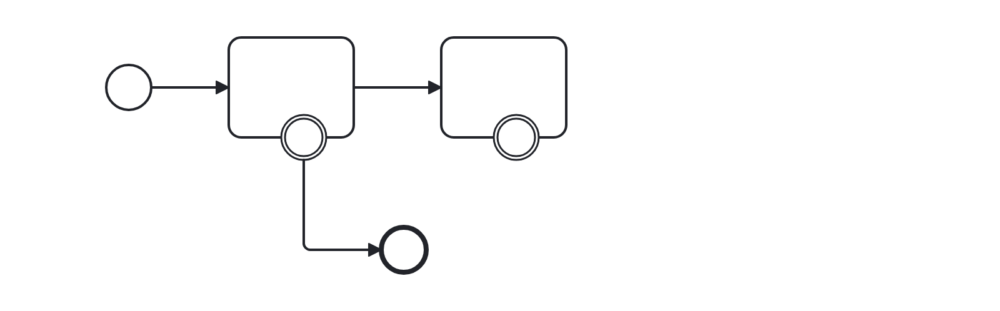

# Standard Size (standard-size)

Checks that elements have a standard size, keeping a diagram tidy and readable.


Example of __incorrect__ usage for this rule:



Cf. [`standard-size-incorrect.bpmn`](./examples/standard-size-incorrect.bpmn).


Example of __correct__ usage for this rule:



Cf. [`standard-size-correct.bpmn`](./examples/standard-size-correct.bpmn).


## Configuration

Sizes are configurable per element type. Provide a map of BPMN element
type to its expected `width` and `height`:

```json
{
  "rules": {
    "standard-size": [ "warn", {
      "bpmn:Task": { "width": 120, "height": 80 }
    } ]
  }
}
```