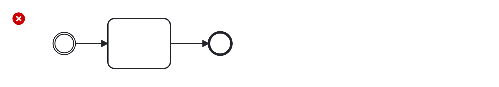

# Start Event Required (start-event-required)

Checks for the presence of a start event in a process or sub-process.

Example of __incorrect__ usage for this rule:

Cf. [`start-event-required-incorrect.bpmn`](./examples/start-event-required-incorrect.bpmn).

Example of __correct__ usage for this rule:

Cf. [`start-event-required-correct.bpmn`](./examples/start-event-required-correct.bpmn).