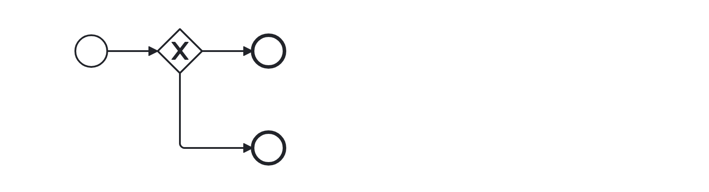

# Gateway One Source Target (superfluous-gateway)

A rule that checks, whether a gateway has only one source and target.  Those gateways are superfluous since they don't do anything.

Example of __incorrect__ usage for this rule:

Cf. [`superfluous-gateway-incorrect.bpmn`](./examples/superfluous-gateway-incorrect.bpmn).

Example of __correct__ usage for this rule:

Cf. [`superfluous-gateway.bpmn`](./examples/superfluous-gateway.bpmn).