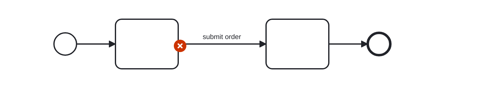
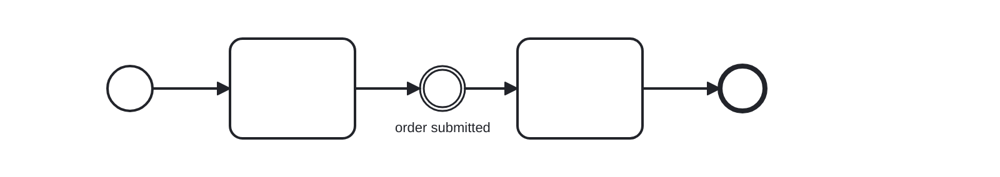

# Redundant Label (superfluous-label)

A rule that checks that no redundant labels are present in a diagram.
Redundant labels duplicate already existing information or may indicate miss-understanding of BPMN semantics.

Example of __incorrect__ usage for this rule:

Cf. [`superfluous-label-incorrect.bpmn`](./examples/superfluous-label-incorrect.bpmn).

Example of __correct__ usage for this rule:

Cf. [`superfluous-label.bpmn`](./examples/superfluous-label-correct.bpmn).