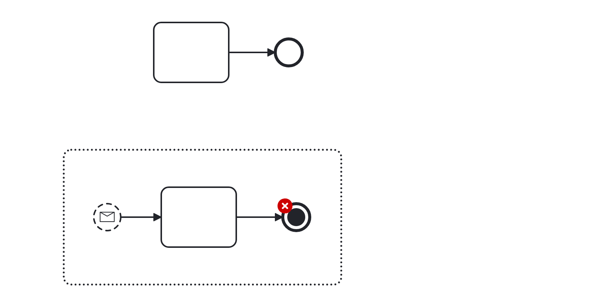
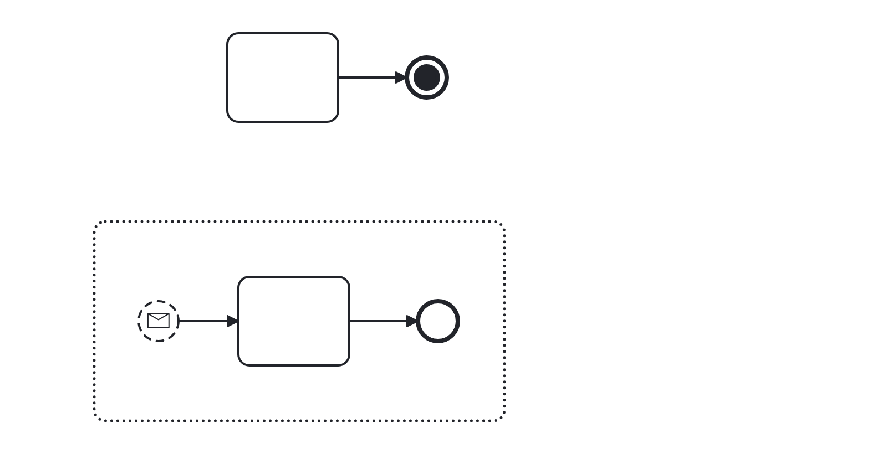

# Redundant Termination (superfluous-termination)

A rule that checks, whether termination is used in a meaningful manner. It cancels other tokens in a running process instance, hence it is superfluous (and potentially missleading) in scenarios where no other tokens to be canceled can exist.

Example of __incorrect__ usage for this rule:

Cf. [`superfluous-termination-incorrect.bpmn`](./examples/superfluous-termination-incorrect.bpmn).

Example of __correct__ usage for this rule:

Cf. [`superfluous-termination.bpmn`](./examples/superfluous-termination-correct.bpmn).